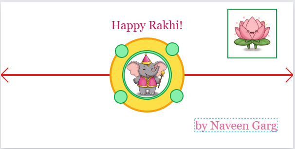
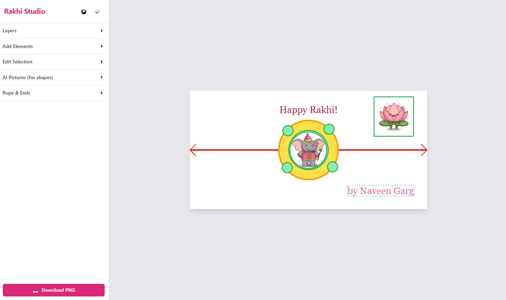
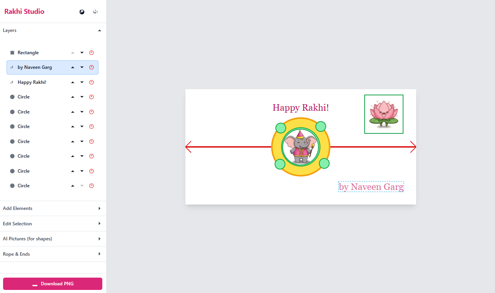

# Rakhi Builder

Welcome to the Rakhi Builder! This is an interactive web application that allows you to design your own custom Rakhi by combining various shapes, text, and AI-generated images. Download your creations as high-quality PNG images to share with family and friends for the Rakshabandhan festival.

<div style="text-align: center;">
  
  <p><em>Image of the first formed Rakhi design</em></p>
</div>

## ✨ Features

- **Interactive Canvas**: A user-friendly SVG-based canvas to build your Rakhi design.
- **Add & Customize Elements**:
  - Add shapes (Circles, Squares) and Text.
  - Drag, resize, rotate, and reorder any element.
- **AI-Powered Images**: Select a shape and generate a unique, happy, cartoon-style image (Peacock, Flower, Elephant, Diya) directly onto it using the Google Gemini API. The images are generated with transparent backgrounds to blend seamlessly.
- **Upload Your Own**: Apply your own images or textures to any shape.
- **Rope Customization**: Change the style (thread, chain, beads), color, curvature, and end-style (tassel, metal-lock) of the Rakhi rope.
- **Layer Management**: Easily manage the stacking order of elements and delete them.
- **Undo/Redo**: Don't worry about mistakes! Full history tracking allows you to undo and redo your changes.
- **Download**: Export your final design as a high-resolution PNG image with a transparent background, ready to be shared.

<div style="text-align: center;">
  
  <p><em>Application running with the main features in the side bar</em></p>
</div>

## 🛠️ Technologies Used

- **Frontend**: React, TypeScript, Tailwind CSS
- **AI Integration**: Google Gemini API (`@google/genai`) for image generation.
- **Image Export**: `html-to-image` library to convert the final SVG/HTML canvas to a PNG.
- **No Build Step**: The project runs directly in the browser using ES Modules and an `importmap`.

## 🚀 Getting Started

### Prerequisites

You need a modern web browser that supports ES Modules. You will also need a Google Gemini API Key to use the AI image generation feature.

- [Get a Google Gemini API Key](https://aistudio.google.com/app/apikey)

### Installation & Setup

1.  **Clone the repository:**
    ```bash
    git clone https://github.com/your-username/rakhi-builder.git
    cd rakhi-design-studio
    ```

2.  **Create an environment file:**
    Create a new file named `.env` in the root of your project directory. This file will store your secret API key and will be ignored by Git.

3.  **Add your API Key:**
    Open the `.env` file and add your Google Gemini API key as follows:
    ```
    API_KEY="YOUR_GOOGLE_GEMINI_API_KEY"
    ```

4.  **Run the application:**
    Since this project does not have a build step, you just need to serve the files with a local web server. One of the easiest ways is to use the [Live Server extension in VS Code](https://marketplace.visualstudio.com/items?itemName=ritwickdey.LiveServer).

    Alternatively, you can use any simple command-line server. For example, with Node.js installed:
    ```bash
    # If you don't have 'serve' installed, install it globally
    npm install -g serve

    # Run the server from the project root
    serve
    ```
    Now, open your browser and navigate to the local URL provided (e.g., `http://localhost:3000`).

## 🎨 How to Use

1.  **Add Elements**: Use the "Add Elements" panel to add circles, squares, or text to the canvas.
2.  **Select & Edit**: Click on any element on the canvas to select it. The "Edit Selection" panel will appear, allowing you to change its size, rotation, color, or text content.
3.  **Generate AI Pictures**:
    - Select a shape (like a circle).
    - Go to the "AI Pictures" panel.
    - Click on an object (e.g., "Peacock"). An AI-generated cartoon image of a peacock will be created and applied as the fill for your selected shape.
4.  **Manage Layers**: Use the "Layers" panel to see all your elements. You can reorder them, delete them, or select them from this list.
5.  **Design the Rope**: Customize the Rakhi's rope using the "Rope & Ends" panel.
6.  **Download**: Once you are happy with your design, click the "Download PNG" button to save your creation!

<div style="text-align: center;">
  
  <p><em>Suggestion: Replace this with a screenshot of your running application!</em></p>
</div>

## 🤝 Contributing

Contributions are welcome! If you have ideas for new features or find a bug, please open an issue or submit a pull request.

## 📄 License

This project is open-source. Consider adding a license file (e.g., `LICENSE.md`) with a license like MIT.
